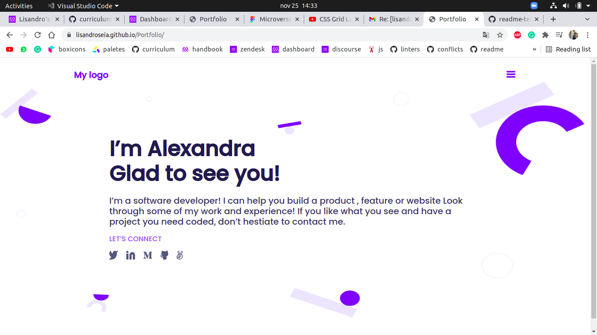

Portfolio

> this is my second microverse project

## Project description:
 
 In this project i made a copy of the template from [this page](https://www.figma.com/file/l7SqJ3ZfkAKih9sFxvWSR4/Microverse-Student-Project-1?node-id=0%3A1)

## Built With

- Major languages
html & css
- 
- Technologies used:
  github

## Live Demo

[Live Demo Link](https://lisandroseia.github.io/Portfolio/)

## getting started
**Set up**

This project is based on mobile size, so you should inspect the demo in mobile or responsiveness sizes

## Authors

👤 **Author1**

- GitHub: [@lisandroseia](https://github.com/lisandroseia)
- LinkedIn: [LinkedIn](https://www.linkedin.com/in/lisandro-seia-295120225/)

## 🤝 Contributing

Contributions, issues, and feature requests are welcome!

Feel fre to check the [issues](https://github.com/lisandroseia/Portfolio/issues) page

## Show your support

Give a ⭐️ if you like this project!

## license

this project is [MIT](https://github.com/lisandroseia/Portfolio/blob/main/LICENSE) licensed.